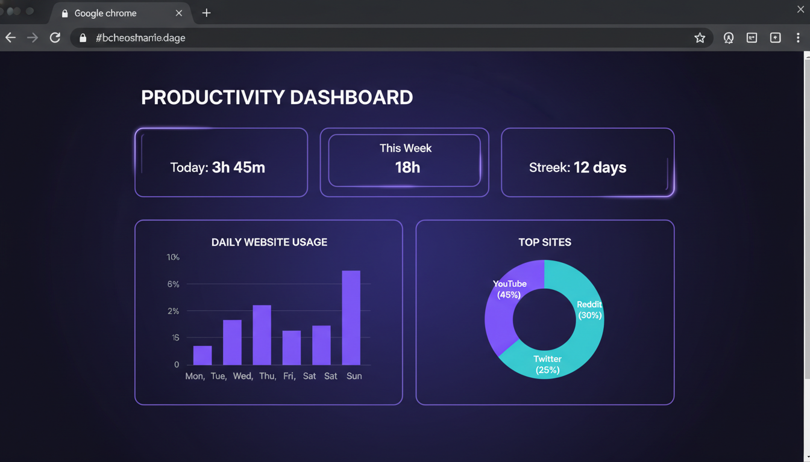
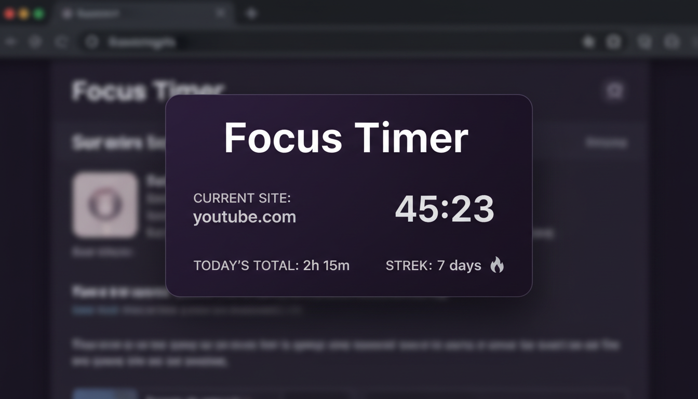
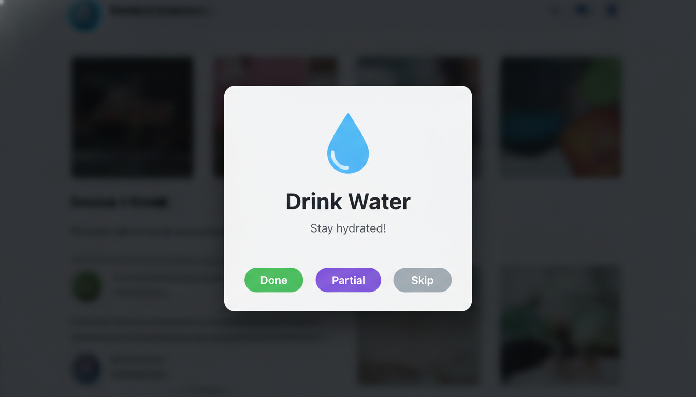
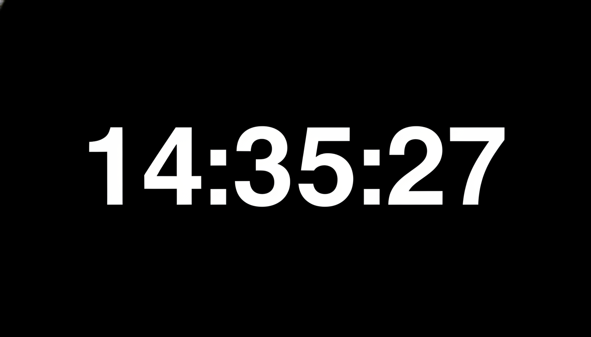

# Focus Timer

A Chrome extension to track time spent on websites, set limits, build better habits, and stay focused.



## Features

### Time Tracking
- Automatically tracks time spent on every website
- Real-time floating timer on each page
- Daily and all-time statistics
- Visual charts showing browsing patterns

### Website Limits
- Set daily time limits for distracting sites
- Warning notifications when approaching limit
- Full-screen block when limit exceeded

### Smart Reminders
- Custom reminders for healthy habits (drink water, stretch, etc.)
- Interval-based or daily scheduled notifications
- Beautiful popup notifications
- Habit tracking with heatmap visualization

### Focus Clock
- Fullscreen minimalist clock for deep work
- Right-click extension icon → Focus Clock
- Perfect for Pomodoro or focused work sessions

### Cloud Sync
- Optional Google Drive backup
- Sync data across devices
- Automatic daily backups

## Installation

### From Chrome Web Store
[Coming soon]

### Manual Installation (Developer Mode)
1. Download or clone this repository
2. Open Chrome and go to `chrome://extensions/`
3. Enable "Developer mode" (top right)
4. Click "Load unpacked"
5. Select the `focus-extension` folder

## Privacy

All data is stored locally on your device. Optional Google Drive sync stores data in your own account. No data is sent to any third-party servers.

See [PRIVACY.md](PRIVACY.md) for full privacy policy.

## Tech Stack

- Manifest V3
- Chrome Storage API (local + sync)
- Chrome Alarms API
- Google Drive API (optional sync)
- Vanilla JavaScript
- CSS3 with CSS Variables

## Project Structure

```
focus-extension/
├── manifest.json          # Extension manifest
├── background/
│   └── service-worker.js  # Background service worker
├── popup/
│   ├── popup.html         # Extension popup
│   ├── popup.css
│   └── popup.js
├── options/
│   ├── options.html       # Dashboard & settings
│   ├── options.css
│   └── options.js
├── content/
│   └── floating-timer.js  # Floating timer & reminders
├── clock/
│   ├── clock.html         # Fullscreen focus clock
│   └── clock.js
├── services/
│   └── drive-sync.js      # Google Drive sync
├── icons/                 # Extension icons
└── store-assets/          # Chrome Web Store assets
```

## Development

```bash
# Clone the repository
git clone https://github.com/yourusername/focus-timer.git

# Load in Chrome
# 1. Go to chrome://extensions/
# 2. Enable Developer mode
# 3. Click "Load unpacked"
# 4. Select the focus-extension folder
```

## Contributing

Contributions are welcome! Please feel free to submit a Pull Request.

## License

MIT License - see [LICENSE](LICENSE) for details.

## Screenshots

| Popup | Dashboard |
|-------|-----------|
|  |  |

| Reminder | Focus Clock |
|----------|-------------|
|  |  |
